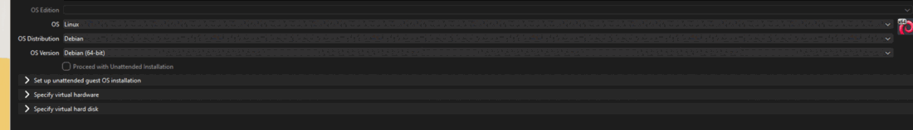
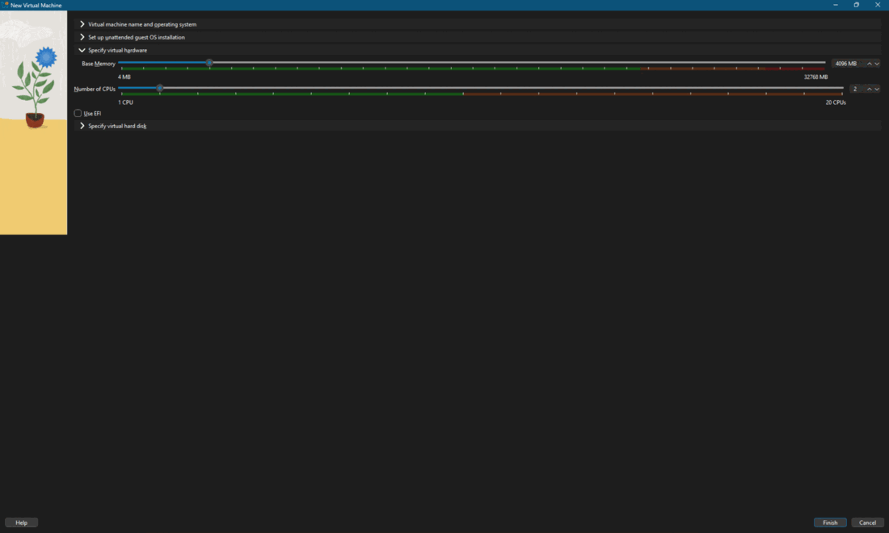
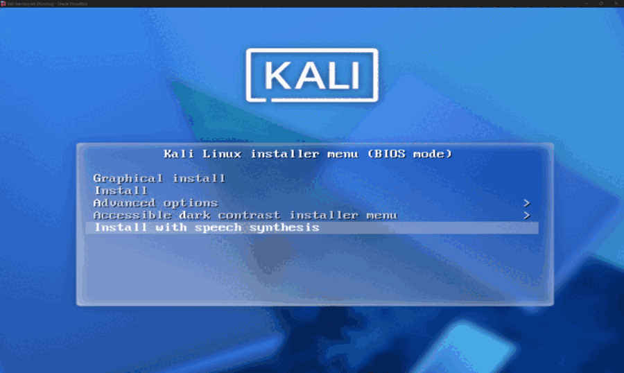
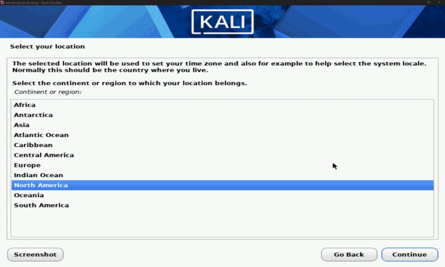
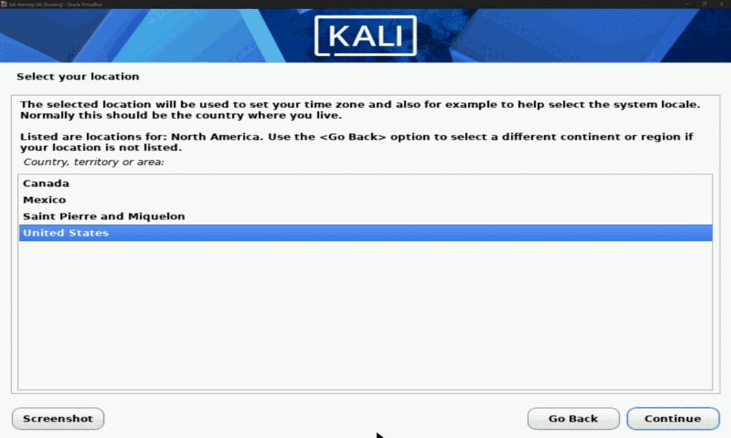

# Optional Manual ISO Installation

The official prebuilt VirtualBox image is faster and easier. Use this workflow when you want to practice the installer or need custom disk, user, desktop, or package choices.

## 1. Download the installer image

Open [Get Kali](https://www.kali.org/get-kali/) and download the current **Installer** image for `x86_64`. Verify its SHA256 using the process in the main README.

## 2. Create a new VM

In VirtualBox Manager, select **New** and use:

| Setting | Value |
| --- | --- |
| Name | Kali Linux |
| Type | Linux |
| Version | Debian (64-bit) |
| RAM | 4096 MB on this 32 GB host |
| CPUs | 2 |
| Disk format | VDI |
| Allocation | Dynamically allocated |
| Virtual disk maximum | 80 GB |

A dynamically allocated disk grows as data is written; it does not immediately consume the full 80 GB.



> [!NOTE]
> This cropped lab screen shows the correct guest type: **Linux → Debian (64-bit)**. Keep **Proceed with Unattended Installation** unchecked, then configure the virtual hardware and disk before clicking **Finish**.

Leave **Set up unattended guest OS installation** alone: **Proceed with Unattended Installation** must remain unchecked. Kali's installer will then run normally, letting you choose your own account and password during setup. Leave **Install Guest Additions** unchecked; guest tools can be repaired later if needed.

### Configure virtual hardware



For this 32 GB host, use **4096 MB** of base memory and **2 CPUs**. Leave **Use EFI** unchecked. Do not give Kali more than half of the host's RAM or every available CPU.

### Create the virtual hard disk

Select **Create a New Virtual Hard Disk**, keep **VDI (VirtualBox Disk Image)** selected, and leave **Pre-allocate Full Size** and **Split Disk into 2 GB Parts** unchecked. Set the virtual disk maximum to **80 GB** before clicking **Finish**. The VDI is dynamically allocated, so it grows as Kali uses space rather than immediately consuming 80 GB.

## 3. Tune the VM before first boot

- **System → Boot Order:** Hard Disk first, Optical second
- **System → Processor:** 2 CPUs; enable PAE/NX
- **Display → Video Memory:** 128 MB
- **Display → Graphics Controller:** VMSVGA
- **Network → Adapter 1:** NAT
- If graphical corruption occurs, disable 3D acceleration

## 4. Mount the ISO

Open **Settings → Storage**, select the empty optical drive, choose the disk icon, and select the downloaded Kali ISO. Start the VM and choose **Graphical install**.



At this menu, use the arrow keys to highlight the first option, **Graphical install**, then press **Enter**. The **Install with speech synthesis** option shown in this screenshot is an accessibility option; use it only if you need speech output.


Choose **English** (or your preferred language), then select **Continue**. This choice becomes the default language for the installed Kali system.



For the U.S. setup shown here, choose **North America**.



Then choose **United States**. This sets the locale and helps the installer select the correct time zone. Choose your own region and country if you live elsewhere.

Follow the remaining installer prompts for keyboard, time zone, username, password, partitions, and desktop packages. Guided partitioning is appropriate for this virtual disk because it does not touch the Windows host disk.

## 5. Finish and eject the ISO

After installation, reboot. If the installer starts again, power off the VM and remove the ISO from **Settings → Storage** or change the boot order so the virtual hard disk comes first.

## 6. Update and verify guest tools

```bash
sudo apt update
sudo apt full-upgrade -y
sudo apt install -y --reinstall virtualbox-guest-x11
sudo reboot
```

Create a **Clean Install - Updated** snapshot after the first successful reboot.

Official references:

- [Kali inside VirtualBox](https://www.kali.org/docs/virtualization/install-virtualbox-guest-vm/)
- [VirtualBox User Manual](https://www.virtualbox.org/manual/UserManual.html)
